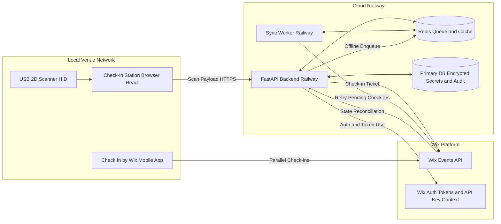

# Wix Event QR Check-In System

## Project Description

This project provides a robust QR code-based event check-in platform for Wix-managed events.

Attendees present a QR code ticket, a USB 2D scanner (HID keyboard mode) reads the code, and the system validates and checks the ticket in through Wix APIs. The platform is designed to operate reliably in real venue conditions where internet connectivity may be unstable.

Core goals:

- Fast, low-friction check-in flow at entry points.
- Reliable operation during intermittent network outages.
- Strong duplicate check-in prevention, even across retries and reconnections.
- Operational visibility through metrics and health dashboards.
- Scalable architecture that supports multiple devices and check-in stations.

## Objectives and Non-Goals

### Objectives

- Integrate QR scanning with Wix Events ticket check-in.
- Maintain an offline-capable queue for pending check-ins.
- Prevent duplicate check-ins with idempotent processing.
- Provide event/block configuration and administrative tools.
- Provide real-time and historical check-in metrics.

### Non-Goals (Initial Scope)

- Replacing Wix as source of truth for ticket ownership.
- Building a custom mobile scanner app (scanner is HID keyboard mode).
- Full BI platform beyond operational dashboards.

## Technology Stack

- Backend API: Python + FastAPI
- Frontend: React + Vite
- UI components: shadcn/ui
- Styling: Tailwind CSS
- Toast notifications: Sonner
- Cache / Queue / Fast state: Redis
- Primary relational DB: PostgreSQL
- External integration: Wix Events API
- Optional worker: Python background worker process (can be in same service initially)

## Database Schema Baseline

Canonical SQL schema for implementation:

- [docs/DB_SCHEMA.sql](docs/DB_SCHEMA.sql)

Why this schema exists:

- Covers Story scope for events/blocks/config versioning, check-ins, idempotency ledgers, queue visibility, relay operations, metrics, reconciliation, auth/credential audit, and RBAC.
- Keeps Wix as source of truth while storing operational state needed for offline reliability and observability.
- Aligns with Redis usage (fast queue/cache) while persisting security-sensitive and auditable data in PostgreSQL.

## Development Mode (Local Docker)

For local development, run PostgreSQL and Redis with Docker Compose.

Compose file:

- [infra/docker/docker-compose.dev.yml](infra/docker/docker-compose.dev.yml)

Start local infrastructure:

```bash
docker compose -f infra/docker/docker-compose.dev.yml up -d
```

Stop local infrastructure:

```bash
docker compose -f infra/docker/docker-compose.dev.yml down
```

Notes:

- PostgreSQL initializes automatically with [docs/DB_SCHEMA.sql](docs/DB_SCHEMA.sql).
- Redis runs with AOF enabled for durability in local testing.
- Backend/frontend app containers can be added later; this file currently provides core dependencies.

## Wix MCP Workspace Setup (VS Code)

This workspace includes a preconfigured MCP server entry for Wix in [`.vscode/mcp.json`](.vscode/mcp.json).

Configured server:

- `wix-mcp-remote` -> `https://mcp.wix.com/mcp`

### How to Enable It

1. Open this workspace in VS Code.
2. Ensure Node.js 19.9.0+ is installed on your machine.
3. Open Command Palette and run `MCP: List Servers`.
4. Select `wix-mcp-remote` and start it.
5. Approve the trust prompt when VS Code asks to trust the MCP server.

### Validation

1. Open Chat in Agent mode.
2. Ask a Wix-specific prompt (for example: "List available Wix MCP tools" or "Search Wix Events API docs for ticket check-in").
3. Confirm MCP tool invocations appear in chat.

### Optional Authenticated Setup

If your workflow requires account-scoped operations, configure headers (`Authorization` and `wix-account-id`) in [`.vscode/mcp.json`](.vscode/mcp.json) using VS Code MCP input variables or environment-based secrets. Do not commit plain API keys.

## High-Level Architecture

1. Scanner input is captured in the React app via a focused input listener.
2. React sends scanned payload to FastAPI (`/scan` or `/checkins`).
3. FastAPI parses QR payload and extracts `ticketNumber` and event metadata.
4. FastAPI runs duplicate and eligibility checks against Redis and Wix.
5. If online and valid, FastAPI calls Wix check-in endpoint and records local state.
6. If Wix is unreachable, FastAPI stores the request in Redis pending queue.
7. A sync worker retries pending queue items with backoff and idempotency safeguards.
8. Metrics are updated in Redis and exposed to dashboard endpoints.

## Architecture Diagram (Operational View)



## Deployment Topology (Railway + Local Venue)

### Do you need a local computer in the venue network?

Short answer: yes, for scanning stations, but not for hosting the backend.

- You need at least one local computer or tablet at each check-in point to run the browser UI and receive HID scanner input.
- You do not need to host FastAPI locally if backend and worker run in Railway.
- The local station must have stable internet access to reach Railway and Wix.
- If internet is unstable, local scanning can still continue because backend queues check-ins in Redis and syncs later.

### What runs where

- Local venue:
	- USB scanner (HID keyboard mode)
	- Browser with React operator app
	- Optional kiosk mode device for reliability
- Cloud Railway:
	- FastAPI API service
	- Background sync worker
	- Redis
	- Primary DB for encrypted credentials and audit logs
- Wix cloud:
	- Ticket check-in source of truth
	- Mobile app check-in path in parallel

## Kiosk Login And Event Scoping

The kiosk should not use a normal human desktop login flow. It should boot straight into a locked operator landing page and wait for a scan.

Recommended startup flow:

1. Debian auto-boots the kiosk account and launches the browser in full-screen kiosk mode.
2. The React app opens to a landing page with a focused hidden input and a clear "ready to scan" state.
3. If no event is active, the first QR is treated as a station bootstrap QR, not an attendee ticket.
4. That bootstrap QR binds the kiosk session to one event and one station context.
5. After the event is selected, all subsequent scans are treated as attendee tickets for that event until the kiosk is reset, timed out, or re-bootstrapped.

Use cases for the bootstrap QR:

- Event assignment for a given station.
- Operator/session authorization for a shift.
- Quick recovery after reboot without typing credentials.

Do not use the attendee ticket QR as the login method. The attendee QR should only identify the ticket to be checked in after the kiosk is already in scan mode.

### Event Scope Handling

Each kiosk session should carry:

- `activeEventId`
- `activeStationId`
- `bootstrapSessionId`
- `operatorId` when a staff identity is known

If the scanned bootstrap QR belongs to a different event than the active one, the app should either reject it or require an explicit admin override. That keeps one station from accidentally processing the wrong event.

### Offline Ticket Coverage

The current implementation plan should include a local event ticket manifest, not just a check-in ledger.

- The app needs a cached list of tickets for the active event so it can validate known ticket numbers when Wix is unavailable.
- The local store should keep ticket state, last known Wix sync time, and a reconciliation marker per ticket.
- When offline, scans should still be accepted or rejected against the cached manifest and local dedupe state.
- When connectivity returns, the worker should reconcile local state back to Wix.

This does not replace Wix as source of truth. It gives the kiosk enough local context to keep operating when Wix is slow or temporarily down.

## Recommended Architecture for Your Goal

If your main objective is high reliability with minimal local maintenance, the current direction is good with one improvement: add an optional local edge relay for degraded internet sites.

### Recommended baseline (most teams)

- Keep backend, worker, Redis, and DB in cloud (Railway).
- Use browser-based local stations for scanner input.
- Keep Wix as source of truth for final check-in state.
- Keep strong idempotency and reconciliation.

This is usually best when venues have acceptable internet and you want simpler operations.

### Recommended enhanced option (for unstable venues)

- Add a lightweight local edge relay service in the venue.
- Relay accepts scans on LAN, buffers locally if WAN fails, then forwards to cloud when internet returns.
- Cloud remains authoritative for business logic, auditing, and reconciliation.

Use this option if internet outages are frequent or long and you cannot risk station-level interruptions.

### Decision guide

- Choose cloud baseline if outage risk is low to moderate.
- Choose edge relay architecture if outage risk is high or check-in volume is very high.
- In both options, continue supporting parallel operation with Check In by Wix app and periodic drift reconciliation.

## Component Design

### 1) Frontend (React)

Responsibilities:

- Capture scanner data from HID keyboard stream.
- Maintain focus-safe scan input mode for operator screens.
- Display immediate result states: success, duplicate, invalid, offline queued, error.
- Provide admin pages for event/block configuration.
- Provide credential management screens for Wix access tokens and API keys.
- Show metrics dashboard and synchronization status.

Implementation notes:

- Use a global `keydown` event listener on `window` instead of a hidden focused input. HID scanners operate in keyboard emulation mode: they type the QR payload at high speed and send `Enter` at the end. A global hook captures all keystrokes regardless of where focus is, making the kiosk immune to accidental focus loss.
- Buffer incoming characters and flush on `Enter` (configurable terminator). Apply a short debounce (e.g. 50 ms) to coalesce the burst.
- Validate payload length and character set before dispatching to the backend.
- Use Sonner `toast` for transient operator feedback that does not block the screen.
- Add audible/visual feedback with latency target under 250 ms for local response.

### Kiosk Operator Screen — 3-State Full-Screen UI

The main check-in screen must cover the entire viewport and cycle through three states. Text sizes must be `text-5xl` or larger so they are readable at one metre distance. Use shadcn `Card` for any framed content areas.

**1. Idle state (waiting for scan)**

- Dark or deep-blue background.
- Subtle `animate-pulse` animation on the scan icon or ring.
- Primary message (Spanish default): `"Por favor, acerque su código QR o Ticket al escáner"`.
- Small status bar at the bottom showing scanner connection, backend health, and active event.

**2. Success state**

- Full-screen emerald green background (`bg-emerald-500`).
- Giant `CheckCircle` icon centered.
- Text: `"¡ACCESO CONCEDIDO!"` in bold uppercase at `text-7xl` or larger.
- Auto-returns to Idle after 2.5 seconds.
- Optionally show ticket number or attendee name at smaller size below the main message.

**3. Error / rejection state**

- Full-screen rose red background (`bg-rose-600`).
- Giant alert icon centered.
- Text: `"TICKET INVÁLIDO o YA PROCESADO"` in bold uppercase at `text-7xl` or larger.
- Show a specific rejection reason at smaller size (e.g. duplicate, outside window, unknown ticket).
- Auto-returns to Idle after 3 seconds or on next scan.

State transitions:

```
Idle → (scan received) → pending API call → Success or Error → (timer) → Idle
```

Do not show a loading spinner between scan and response if latency is under 300 ms. If the API call takes longer, show a brief neutral "processing" overlay rather than blocking the screen.

Required admin screens:

- Authentication Settings screen:
	- Configure Wix authentication mode (OAuth access token or API key mode).
	- Show token status (active, expires at, last refresh).
	- Trigger manual token refresh and connectivity test.
- API Key Management screen:
	- Enter/update Wix API key and account ID through masked secure inputs.
	- Validate credentials before save.
	- Display last rotation timestamp and last validation result.
- Secret Rotation and Audit screen:
	- Rotate credentials with confirmation.
	- Show audit log (actor, time, action, success/failure).

### 2) Backend API (FastAPI)

Responsibilities:

- Expose REST endpoints for scan/check-in/config/metrics/ops.
- Parse and validate QR payloads.
- Enforce idempotent check-in and duplicate prevention.
- Communicate with Wix APIs and handle retries/backoff.
- Write/read Redis for queueing, cache, dedupe sets, and metrics.
- Manage secure storage, retrieval, rotation, and refresh of Wix credentials.
- Maintain a local ticket manifest cache for the active event so offline validation can continue during Wix outages.

Suggested endpoint surface:

- `POST /api/checkins/scan`: submit raw scan data.
- `POST /api/checkins/manual`: admin manual override check-in.
- `GET /api/checkins/status/{ticketNumber}`: fetch check-in status.
- `GET /api/events`: list configured events.
- `POST /api/events/{eventId}/blocks`: configure blocks.
- `POST /api/events/{eventId}/reset`: clear check-ins (audited).
- `GET /api/metrics/summary`: aggregate totals.
- `GET /api/health`: health/readiness.
- `GET /api/auth/status`: return credential and token health (without exposing secrets).
- `POST /api/auth/test-connection`: validate current Wix credentials.
- `PUT /api/auth/api-key`: securely update Wix API key/account ID.
- `POST /api/auth/token/refresh`: refresh OAuth access token.
- `GET /api/auth/audit`: retrieve credential change audit history.

Credential storage model (secure DB):

- Store secrets encrypted at rest in the primary database (not in Redis).
- Use envelope encryption with a KMS-managed master key when available.
- Persist only encrypted values plus metadata (createdAt, rotatedAt, expiresAt, createdBy).
- Never return raw secret values from read APIs.
- Keep Redis limited to non-secret operational cache and queue data.

### 3) Redis (Caching + Queue + Real-Time State)

Responsibilities:

- Offline pending queue for unsent check-ins.
- Deduplication keys for idempotency and duplicate prevention.
- Event/block configuration cache for low-latency reads.
- Aggregated counters and time buckets for dashboard metrics.

Suggested Redis data model:

- `checkin:processed:{eventId}` (Set): ticket numbers successfully processed locally.
- `checkin:request:{idempotencyKey}` (String/Hash + TTL): request fingerprint.
- `checkin:pending` (Stream or List): queued offline check-ins.
- `checkin:pending:byTicket:{eventId}:{ticketNumber}` (String): pending marker.
- `event:{eventId}:config` (Hash/JSON): event-level config.
- `event:{eventId}:blocks` (Sorted Set or JSON): time blocks + grace period.
- `metrics:event:{eventId}:count` (Counter): total check-ins.
- `metrics:event:{eventId}:block:{blockId}:count` (Counter).
- `metrics:timeseries:{eventId}:{YYYYMMDDHHmm}` (Counter).

### 4) Wix Integration Layer

Responsibilities:

- Validate ticket context with Wix where required.
- Perform check-in via Wix check-in endpoint.
- Normalize Wix responses into internal status model.
- Implement retry with exponential backoff + jitter.

Important considerations:

- Respect Wix API rate limits with token bucket/leaky bucket strategy.
- Use request timeouts and circuit breaker behavior to fail fast.
- Secure credentials via environment variables and secret management.

### 5) Background Sync Worker

Responsibilities:

- Poll/consume pending queue from Redis.
- Retry submissions when connectivity resumes.
- Preserve ordering where required per event/ticket.
- Record terminal outcomes (synced, duplicate-at-source, invalid, failed).

Reliability pattern:

- At-least-once queue processing + idempotent check-in operation.
- Dead-letter queue (DLQ) for repeatedly failing items.
- Operator tools to inspect/retry DLQ items.

## End-to-End Check-In Flow

### Online Flow

1. Scanner sends QR text to frontend.
2. Frontend posts payload to backend.
3. Backend parses ticket number and computes idempotency key.
4. Backend checks Redis dedupe keys.
5. If not duplicate, backend calls Wix check-in API.
6. On success, backend marks ticket as checked-in in Redis and updates metrics.
7. Frontend receives success response with timestamp and source (`wix-online`).

### Offline/Degraded Flow

1. Scan request reaches backend, Wix is unavailable or timed out.
2. Backend performs local dedupe check.
3. Backend stores check-in in Redis pending queue with durable metadata.
4. Backend returns `queued-offline` status immediately.
5. Worker retries queued entries later.
6. On successful sync, worker updates status and metrics.

## Duplicate Check-In Prevention Strategy

Use a layered approach to guarantee practical exactly-once behavior:

1. Request idempotency key:
	 - Key suggestion: `hash(eventId + ticketNumber + blockId + operationType)`.
2. Fast local guard in Redis:
	 - Reject if `checkin:processed:{eventId}` already contains `ticketNumber`.
3. Pending guard:
	 - Reject or coalesce if pending marker already exists for same ticket/event.
4. Source-of-truth reconciliation:
	 - If ambiguity exists, query Wix ticket status before final decision.
5. Atomic writes:
	 - Use Redis transactions/Lua scripts for check-and-set operations.

Recommended response statuses:

- `CHECKED_IN`
- `ALREADY_CHECKED_IN`
- `QUEUED_OFFLINE`
- `INVALID_TICKET`
- `OUTSIDE_BLOCK_WINDOW`
- `ERROR`

## Event and Block Configuration

Admin users can configure:

- Event identity (Wix event mapping).
- Block definitions (`blockId`, name, start/end).
- Early check-in grace window (minutes before block start).
- Optional overlap policy between blocks.
- Reset permissions and confirmation requirements.

Validation rules:

- Start time < end time.
- No unintended overlaps unless explicitly allowed.
- Grace period bounded (for example 0-120 min).
- All configs versioned and audit logged.

Early check-in logic:

- If scan time is within `start - gracePeriod` to `end`, assign check-in to that block.
- If multiple blocks qualify, apply deterministic priority (nearest start time).

Batch reset behavior:

- Reset by event or specific block.
- Requires elevated role + confirmation.
- Write audit trail with actor, time, scope, and reason.

## Wix Synchronization for Check In by Wix Mobile App

This section explains how to configure database synchronization with Wix so your local HID scanner workflow and the Check In by Wix mobile app can run in parallel.

### Configuration Steps

1. Enable Wix synchronization:
	- Open the Event Configuration screen in the admin UI.
	- Find the Wix Synchronization toggle and set it to enabled.
	- Save the configuration so scheduled synchronization starts.

2. Set synchronization frequency:
	- Configure the sync interval in the same Event Configuration area.
	- Recommended interval: 1 to 2 minutes for near real-time consistency.
	- Use 1 minute for high-traffic events and 2 minutes for lower traffic.

3. Enable parallel scanner operation:
	- Keep local HID scanner check-in enabled in the operator UI.
	- Confirm the event is also accessible in the Check In by Wix mobile app.
	- Verify both flows write to and read from Wix as shared source-of-truth for check-in state.

### Operational Notes

- Active internet connectivity is required for synchronization between this system and Wix.
- The Check In by Wix app must be installed on a mobile device and linked to the correct Wix account.
- After synchronization, check-in updates are reflected in both systems, enabling concurrent scanning from desktop HID stations and mobile devices.

### Reliability Recommendations for Sync Mode

- Keep idempotency and duplicate-prevention checks active locally even when sync is enabled.
- During temporary outages, queue local check-ins and sync them on reconnect.
- Run a periodic reconciliation job (for example every 5 to 15 minutes) to resolve drift between local state and Wix.
- Alert operators when sync lag exceeds a defined threshold (for example 3 minutes).

## Metrics Dashboard

Provide near real-time operational metrics:

- Total check-ins (overall and per event).
- Check-ins per block.
- Current attendees.
- Check-in throughput (per minute).
- Queue depth and sync lag.
- Error rates by type (invalid, duplicate, API timeout).

Technical approach:

- Maintain counters in Redis for low-latency reads.
- Use rolling time buckets for trend charts.
- Optionally stream updates via WebSockets/SSE to frontend.

## Performance and Scalability Recommendations

- Keep check-in API stateless; scale horizontally with multiple FastAPI instances.
- Centralize shared state in Redis (single source for dedupe/queue/cache).
- Use connection pooling for Redis and HTTP clients.
- Apply backpressure when Wix is slow (queue-first mode).
- Use async I/O in FastAPI for Wix and Redis calls.
- Add per-endpoint and global rate limiting.
- Use structured logs and correlation IDs for scan request tracing.

Latency targets (suggested):

- Local API acknowledgement: p95 < 300 ms.
- Online Wix check-in round trip: p95 < 1500 ms.
- Offline queue enqueue: p95 < 200 ms.

## Reliability and Fault Tolerance

- Redis persistence: enable AOF (`appendfsync everysec`) for durable queue/state.
- Run Redis with replication + Sentinel/managed equivalent for high availability.
- Implement health checks:
	- Liveness: process health.
	- Readiness: Redis connectivity + Wix dependency state.
- Introduce circuit breaker for Wix failures.
- Retry policy: exponential backoff with jitter and max attempts.
- Dead-letter queue for non-recoverable or repeated failures.
- Regular backups for critical configs and audit records.

## Security Recommendations

- Store Wix credentials in environment variables or a secrets manager.
- If credentials must be persisted in DB, store only encrypted secrets with strict RBAC and audit trails.
- Enforce RBAC for admin features (config/reset/manual override).
- Use signed JWT/OAuth for frontend-authenticated actions.
- Apply TLS in transit for all external/internal traffic.
- Sanitize and validate all scanner input (length, format, character set).
- Add audit logs for sensitive operations.

Credential security controls:

- Secret write/read operations restricted to privileged admin roles.
- Full audit logging for create/update/rotate/test operations.
- Automatic secret rotation reminders and optional forced rotation policy.
- Token refresh job with expiry threshold (for example refresh when less than 10 minutes remain).
- Redact secrets in logs, traces, and error payloads.

## Proposed Repository Structure

```text
.
├── backend/
│   ├── app/
│   │   ├── api/
│   │   ├── core/
│   │   ├── services/
│   │   ├── models/
│   │   └── workers/
│   ├── tests/
│   └── pyproject.toml
├── frontend/
│   ├── src/
│   │   ├── pages/
│   │   ├── components/
│   │   ├── hooks/
│   │   └── services/
│   └── package.json
├── infra/
│   ├── docker/
│   ├── redis/
│   └── monitoring/
└── README.md
```

## Plan Phases

### Phase 1: Core Functionality and MVP

Objective: establish core scan-to-check-in flow with offline queueing and dedupe.

Tasks:

- Bootstrap FastAPI and React projects.
- Implement HID scan capture and QR parsing pipeline.
- Integrate Wix check-in endpoint.
- Implement initial Wix pull/push synchronization service to keep local check-in state aligned with Wix.
- Add Redis-backed pending queue and processed-ticket set.
- Implement basic idempotency + duplicate prevention.
- Implement secure backend credential abstraction (provider interface for env/secrets manager/DB-encrypted storage).
- Add baseline logging, health checks, and error handling.

Deliverables:

- Working check-in endpoint.
- Basic Wix synchronization running on a fixed schedule.
- Offline queue with retry worker.
- Operator UI showing scan outcomes.
- Initial credential provider integrated with Wix API client (no plaintext secret exposure).

### Phase 2: Event Configuration and Management

Objective: enable full event/block administration and policy controls.

Tasks:

- Build event/block admin screens.
- Persist and cache configurations in Redis.
- Add Event Configuration controls for Wix Synchronization enable/disable and sync interval (recommended 1 to 2 minutes).
- Build Authentication Settings and API Key Management screens.
- Implement encrypted credential persistence in DB and validation workflow.
- Implement grace period and block assignment rules.
- Implement event/block reset with audit logging.
- Harden validation and conflict handling.

Deliverables:

- Configurable event operations.
- Admin-managed Wix synchronization settings and validation.
- Admin credential management UI with secure DB-backed secret storage.
- Safe reset tools with auditable actions.

### Phase 3: Metrics and Monitoring

Objective: provide visibility into operations and system health.

Tasks:

- Build dashboard for key operational metrics.
- Implement metrics aggregation endpoints.
- Add queue depth/sync lag/error analytics.
- Add synchronization health metrics for Wix parity (last successful sync time, drift count, and reconciliation results).
- Add auth observability metrics (token expiry horizon, refresh success rate, credential validation failures).
- Add alerting hooks for degraded service states.

Deliverables:

- Real-time dashboard.
- Basic observability with actionable alerts.
- Credential and token health monitoring with alert thresholds.

### Phase 4: Optimization, Security, and Deployment

Objective: production hardening, scalability, and secure rollout.

Tasks:

- Optimize Redis key design and memory usage.
- Add full authn/authz and permission boundaries.
- Implement production secret rotation runbook and optional KMS-backed encryption migration.
- Expand test coverage (unit/integration/e2e/load/failure tests).
- Add CI/CD, deployment manifests, and runbooks.
- Conduct resilience drills and fix edge cases.

Deliverables:

- Production-ready deployment package.
- Security-reviewed and performance-validated release.
- Audited and policy-compliant credential lifecycle management.

## UI Screen Map (Including Auth and Credentials)

- Operator Check-In screen: scanner input, status feedback, manual retry.
- Event and Block Configuration screen: event rules, blocks, grace periods, reset tools.
- Wix Synchronization screen: enable/disable sync, interval, last sync status.
- Authentication Settings screen: auth mode, token status, refresh/test controls.
- API Key Management screen: secure API key/account ID update and validation.
- Metrics and Health Dashboard: operational metrics, sync lag, token/auth health, alerts.
- Audit Log screen: sensitive action history for credentials and reset operations.

## Testing Strategy

- Unit tests: QR parser, block-window logic, dedupe logic.
- Integration tests: FastAPI + Redis + mocked Wix API.
- End-to-end tests: scanner-like input to UI and backend response.
- Chaos/failure tests: Wix outage, Redis failover, network partitions.
- Load tests: concurrent scan bursts and queue drain performance.

## Deployment Guidance

- Frontend production hosting: Cloudflare (Cloudflare Pages for React app).
- Backend production hosting: Railway (FastAPI API + worker in the same Railway project).
- Database production hosting: Railway PostgreSQL in the same Railway project as backend services.
- Redis production hosting: Railway Redis (same project) or managed Redis provider.
- Configure environment-specific settings via env vars.
- Add dashboards and alerting before go-live.

### Production Topology Decision

- Cloudflare serves frontend assets and edge delivery.
- Railway runs API, worker, Redis, and PostgreSQL in one project boundary for simpler networking and secret management.
- Wix remains the external source of truth for final ticket check-in state.

## Operational Runbook Essentials

- How to identify queue growth and sync lag.
- How to inspect/retry dead-letter queue items.
- How to rotate Wix credentials safely.
- How to perform emergency fallback to queue-only mode.
- How to execute audited event/block reset.

## Risks and Mitigations

- Wix API rate limits or outages:
	- Mitigation: queue-first fallback, retries, circuit breaker, throttling.
- Scanner focus/input issues in browser:
	- Mitigation: persistent focus handler, kiosk mode, focus watchdog.
- Duplicate scans in high-throughput lines:
	- Mitigation: atomic dedupe keys + short cool-down window.
- Redis data loss risk:
	- Mitigation: AOF persistence, backups, replication, failover testing.

## Configuration and Secrets

Example environment variables:

- `WIX_API_BASE_URL`
- `WIX_API_KEY` or OAuth credentials
- `DATABASE_URL`
- `REDIS_URL`
- `CHECKIN_RETRY_MAX_ATTEMPTS`
- `CHECKIN_RETRY_BASE_MS`
- `DEFAULT_GRACE_PERIOD_MINUTES`
- `JWT_PUBLIC_KEY` / auth config

Never hardcode API keys or secrets in source code.

## Wix API Reference

Primary endpoint for ticket check-in:

- https://dev.wix.com/docs/api-reference/business-solutions/events/registration/ticketing/tickets/check-in-ticket

Use version-aware client wrappers to isolate future API changes.

## Suggested Next Implementation Step

Start with Phase 1 by implementing a vertical slice:

- Scan capture in React -> FastAPI `/api/checkins/scan` -> Redis dedupe -> Wix check-in -> response toast.

Then add offline queueing and sync worker as the next increment.

## Detailed Delivery Backlog

For implementation-ready user stories with tasks and acceptance criteria, see [docs/IMPLEMENTATION_STORIES.md](docs/IMPLEMENTATION_STORIES.md).
